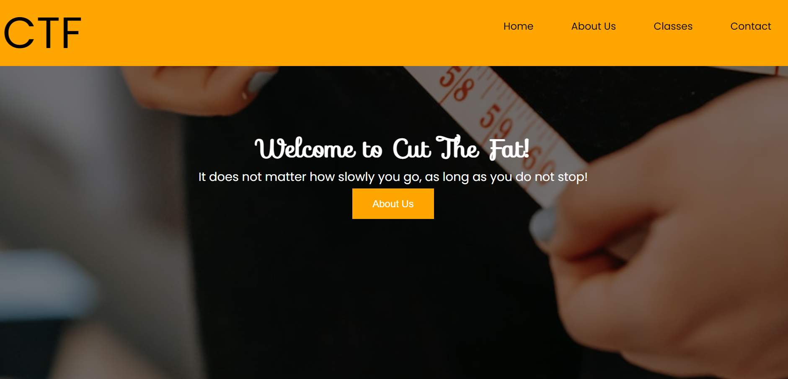
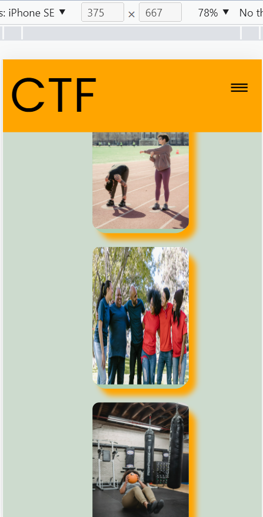
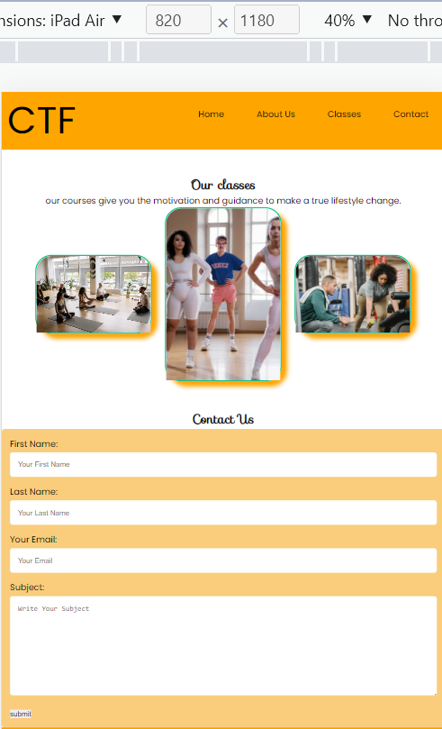
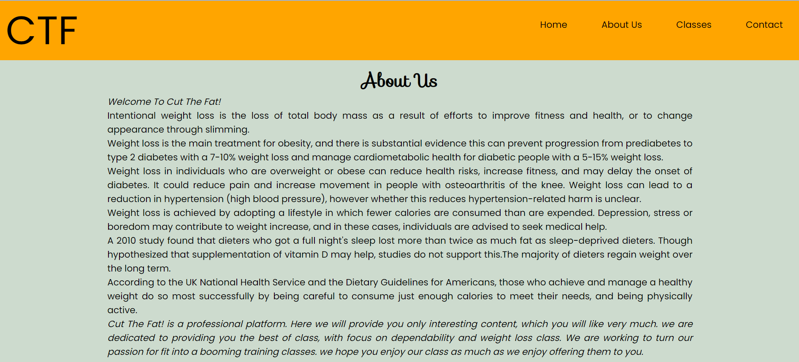
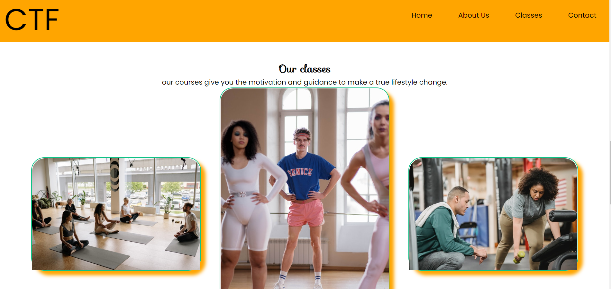
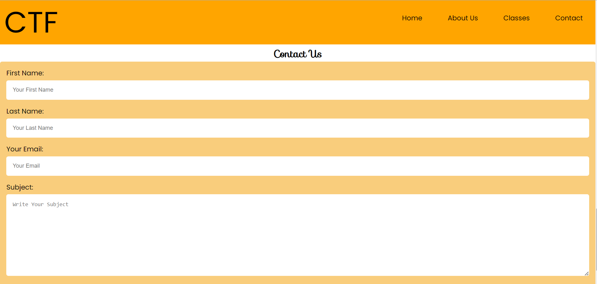
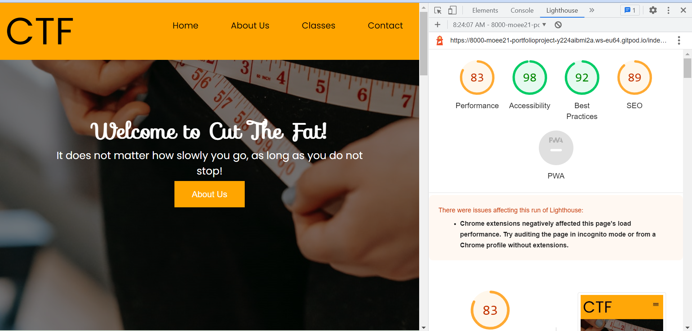

# Cut The Fat!
Cut The Fat! offers different group fitness class types with a good nutrition plan in Angered, Sweden. 
The site will target those looking to lose weight and burn fat to be fitter and healthier, And they will find all the information they need to know about Cut The Fat! starting from us, type of classes, and contact information.

Welcome! https://moee21.github.io/portfolio-project-1/

# Features

# The Header
The Header shows the name of the fitness classes, an excellent motivational quote, and a background image.

# Navigation Bar
The full responsive Navigation bar shows the Home page at the top left center of the page, next to it: About us, Classes, and Contact us Form.
All the sections allow the user to navigate from page to page across all devices.

# About Us Section
About us shows the user the information they need and what they offer.

# Classes Section
The Classes Section will provide the user with supporting images to see what the meet-ups look like.

# Contact Us
The Contact us Form collects the user's first name, last name, email, and subject.
The Subject field allows users to contact fitness classes and write their inquiries.

# Testing
I confirm that the Header, Navigation, About us, Classes section, and Contact us are all readable and easy to understand.
I have confirmed that the Contact Us Form works, entries require in every field, and the submit button works.

# Validator Testing
#### HTML
No error through the official W3C validator.
#### CSS
passed the test through the official (Jigsaw) validator.

#### Accessibility 
I confirm that the colors and fonts chosen are easy to read and accessible by running it through lighthouse in devtools. 

# Bugs
When I added the Header background image and checked it, I discovered that there was no image.
I figured out that the image link was not correctly connecting to my CSS file, and that was because I forgot to use the double dot, which indicates the relative file path.
background-image : url(../img/apple-or-donut.jpg);

# Deployment
The site was deployed to Github pages. The steps to deploy are as follows:
In the Github repository, navigate to the Settings tab.
On the General Navigation bar, on the left-hand side, select pages and then source.
From the Source section drop-down menue, select The main Branch.
Once the master branch has been selected, the page provided the link to the completed website.
The Live link can be found here: https://moee21.github.io/portfolio-project-1/

# Credits
## Content
The quotes on the Header's background is by Confucius.
The text for the about us is from blogearns.com.
Instructions on how to implement media query was from https://w3schools.com .

## Media
All images and photos used on the Header's background and on classes section are from https://www.pexels.com/
